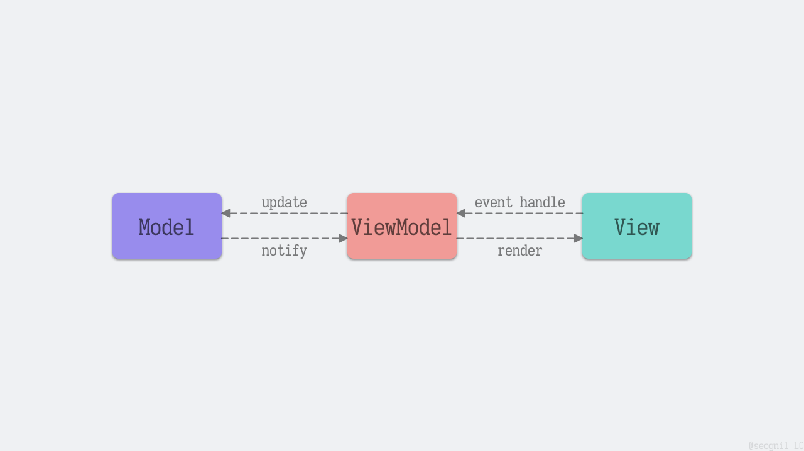
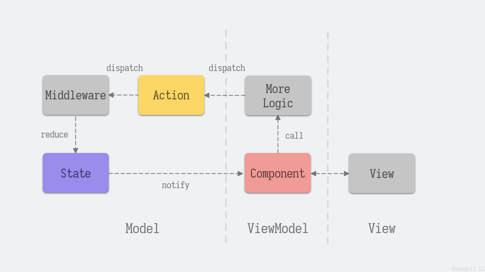
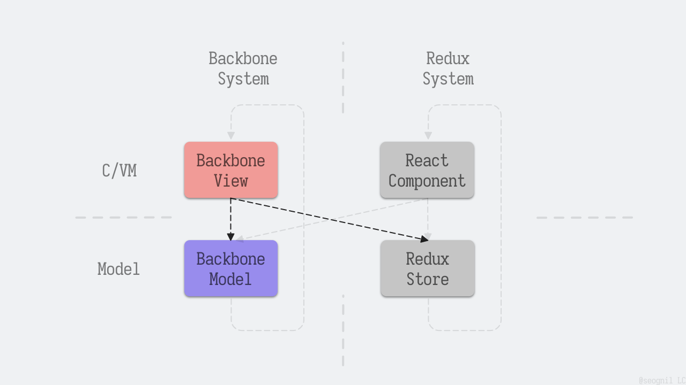
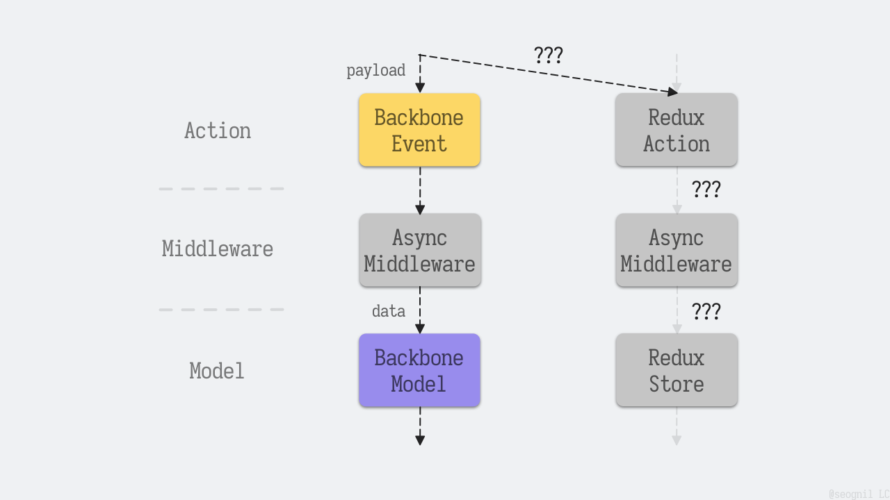
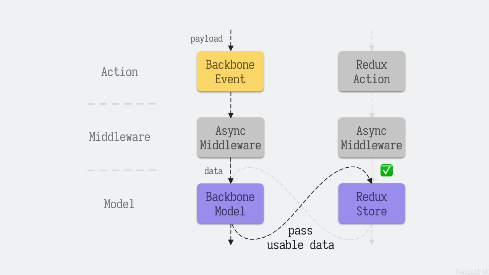
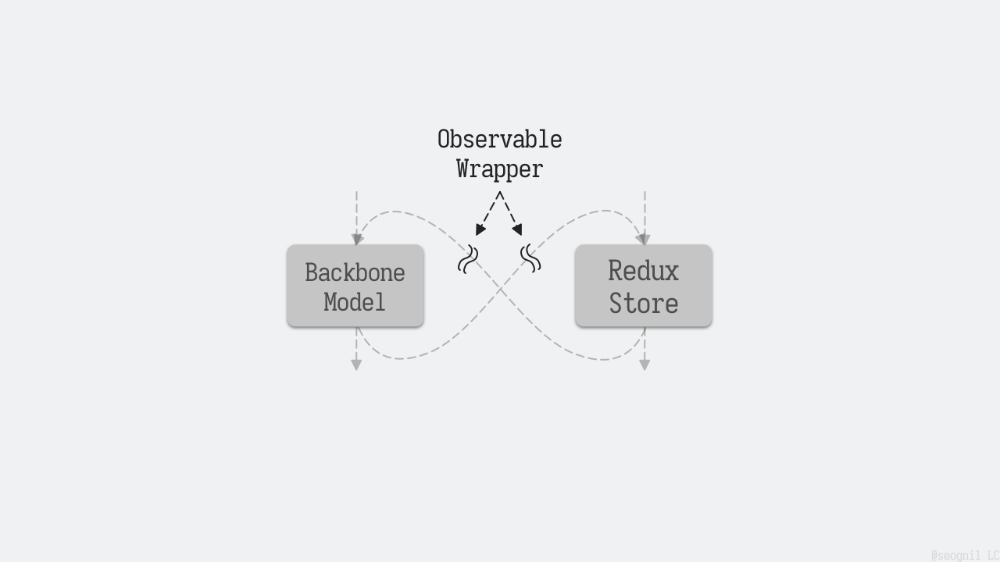
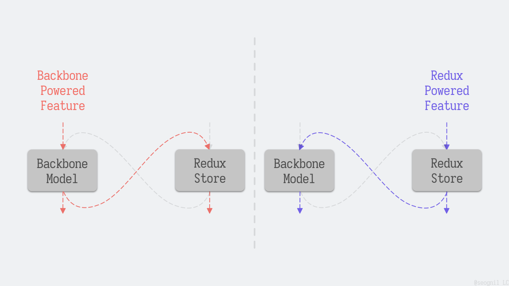
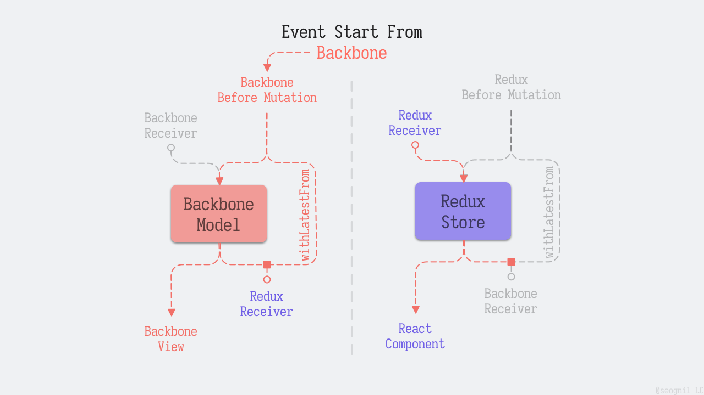
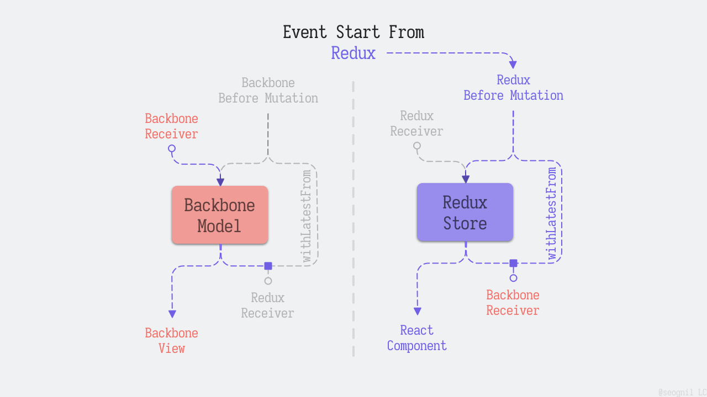
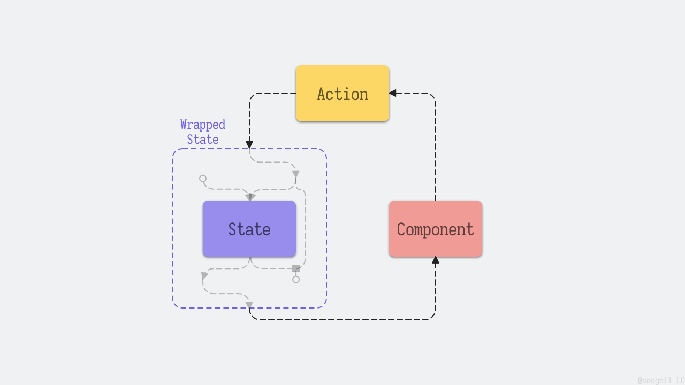

# 在飞行中换发动机：多个状态管理系统（理论篇）

> 返回 [系列目录](../readme.md)

## 前情提要

在上一篇中，我介绍了项目升级的历史背景，确定了渐进式更新代码的项目升级方案、新技术栈选型、以及 Roadmap 规划。

在本篇中，我们需要思考 Roadmap 中的第二阶段，新旧技术栈共存的时期。

> 注：为便于理解，后文中我将把 Backbone 或 Redux，这些以不同开发风格和方式实现的功能，每一种风格称为一个“系统”。

## 需求分析

之前提到了项目存在的问题。

在我们的项目中，有一些功能是用 Backbone.Model 作为状态管理。另一些甚至是手动将数据挂载在 window 上，需要数据更新时，通过 jQuery 直接操作对应的 DOM。

在这些迷惑不清的业务逻辑下，我现在要再接入一个 Redux 作为 React 系统的状态管理器，并且需要保持不同系统间的状态同步。

举个例子，在一个可视化“H5”作品编辑器产品中。基于 Backbone 的画布功能更新了元素数据，那么基于 Redux/React 的侧边栏元素列表需要同步更新，反之亦然。与此同时，选中元素并高亮则是通过 window.selectedOverlay 手动变更状态，手动修改 DOM 实现的。这个高亮的功能，也需要反应在画布和侧边栏中。

要实现不同系统间的状态同步，消耗了我不少脑力。

### 单个系统

众所周知，使用本世代前端框架，如 React 或 Vue 进行应用开发（Angular 我不太熟悉），通常使用 MVVM 架构模式，以及数据驱动的编程模式。状态变更能通过某些机制自动更新视图。



并且 React 和 Vue 在各自生态内有都一套独立的状态管理方案：Redux 和 Vuex，VM 到 M 的逻辑模型大致都是一个单向闭环结构。


如果更加完整地考虑一个应用，可能还会有数据初始化、网络请求、数据持久化、undo/redo 等等功能。

更进一步的，应用可能会包含很多功能：

- 某个业务功能有多种触发方式：快捷键触发、导航栏触发、右键触发等等，不同的用户输入都指向相同的事件。
- 功能本身的逻辑代码复杂：比如数据加工，图像处理等等。

但这些都可以视作环上的不同位置的延展，而没有改变环形结构的整体样貌。



所以，MVC 或 MVVM 可以粗略地划分为三个层次，但是还可以进一步拆分成更细的层次。

写到这里，单个运行系统的架构模型，想必大多数开发者多少都可以理解了。无论是 React 的声明式函数组件代码、还是 Backbone 的类组件、甚至是无框架手撸代码，我们都能在脑海中建立基本一致的模型，所有代码都可以大致分布到这个模型中，这能为我们后续的分析工作做铺垫。

### 多个系统

到这里，事情只做了一半。假如我们只优化旧技术栈，或直接用新技术栈重构，都可以视为单个系统进行开发。

但是别忘了，我们下一个阶段的目标是，长期地逐步地转型。是建立多个系统（主要是 Backbone + Redux），让它们同时存在并相互关联。

但是该怎么做呢？

## 技术分析

### 第一次尝试

害，这简单。在一个 EventHandler 中直接触发不同系统的事件不就行了？



我们先假设一个需求：界面上显示了一个列表，点击某个按钮，在列表中新建一个项。

那么具体到代码（伪代码）：

B 系统：

```js
$('button').on('click', () => {
  const data = { id: Math.random(), text: 'Lorem' };

  // * B 系统调用
  Backbone.trigger('addItem', data);

  // * R 系统调用
  ReduxStore.dispatch(actionOfAddItem({ data }));
});
```

R 系统同理：

```jsx
<button
  onClick={() => {
    const data = { id: Math.random(), text: 'Lorem' };

    // * B 系统调用
    Backbone.trigger('addItem', data);

    // * R 系统调用
    ReduxStore.dispatch(actionOfAddItem({ data }));
  }}
></button>
```

然而事情没我想象的这么简单：

有些事件内的逻辑是异步的，类似 redux 生态中用 redux-thunk 或 redux-saga 的情况。并且可能会涉及到后端通讯，某些数据来源于后端接口。



具体的逻辑可能类似下面这样：

```js
Backbone.on('addItem', () => {
  // ... 一些准备的逻辑
  post(`/api/${projId}/items/${newId}`, (res) => {
    if (res.error) {
      // * 错误处理
    }

    const data = res.data;
    // ... 一些数据处理代码
    // ... 一些回调和渲染逻辑
  });
});
```

原有的 Backbone 代码过程可能比较复杂，如果考虑重构，可能会花费很多精力。诚然，重构也确实在我们的 Roadmap 中，但我们最终是将所有功能用 Redux 的开发模式重构。之前说到，这个过程是长期的，得按功能逐步进行，不可能直接全部重构完毕。所以重构和升级是一件事、多系统关联是另一件事，不可混为一谈。

那么仅考虑系统间的状态关联，而尽量避免对原有的代码进行大幅度改动，我们可以这么做：

```js
Backbone.on('addItem', () => {
  post(`/api/${projId}/items/${newId}`, (data) => {
    // ... 原有的逻辑

    // * R 系统调用
    ReduxStore.dispatch(actionOfAddItem({ data }));
  });
});
```

在原有业务全部完成后，当系统处于 idle 状态时，将此时的状态同步地传递给外部系统。这样就能绕过异步和后端请求之类的业务部分，只考虑系统间状态同步了。

反过来同理，新系统中可能也会有事件需要通知给旧系统。



毕竟，要重构的是脏代码。而已经上线的业务，逻辑都是正常的。

像上面这样硬编码回调逻辑的方式虽然谈不上优雅，但是反正旧代码最后是要用新模式重新实现的，属于计划报废的代码，随意一点也无所谓。而新的模式，Redux 或者 RxJS，甚至本来 Backbone 正规的写法中，都是支持 Observable 的。硬编码的问题可以避免。

比方说，我们还是以刚才的代码为例，套一层 Observable 就能避免直接耦合了：

```js
Backbone.on('addItem', () => {
  post(`/api/${projId}/items/${newId}`, (data) => {
    // ... 原有的逻辑

    // * 用订阅机制来解耦
    Events.trigger('addItemDone', data);
  });
});

// * 用订阅机制来解耦
Events.on('addItemDone', (data) => {
  // * R 系统调用
  ReduxStore.dispatch(actionOfAddItem({ data }));
});
```



总之，要让不同系统间的状态同步，我决定把这同步的过程放在功能完成后，而不是功能开始时。

### 第二次尝试（上）

我们先简化一下实现，把代码的逻辑跑通。重新写一下伪代码：

B 系统：

```js
// * B 系统的状态变更逻辑
BackboneSys.on('willUpdateModel', (data) => {
  const item = make1(data);
  BackboneSys.set(item);
});

// * 新建一条订阅，用于在业务完成后，B 系统将状态转发给 R 系统
BackboneSys.on('change', () => {
  ReduxSys.dispatch({ type, data });
});

// * B 系统状态变更的触发器，触发时机可能是视图层的用户交互
BackboneSys.trigger('willUpdateModel', data);
```

R 系统：

```js
// * R 系统的状态变更逻辑
const theReducer = (state, { type, data }) => make2(state, data);
const ReduxStore = createStore(theReducer);

// * 新建一条订阅，用于在业务完成后，R 系统将状态转发给 B 系统
ReduxStore.subscribe(() => {
  const data = getData();
  BackboneSys.trigger('willUpdateModel', data);
});

// * R 系统状态变更的触发器，触发时机可能是视图层的用户交互
ReduxStore.dispatch({ type, data });
```

看上去还行，但是脑内模拟一下……

B 系统触发了事件 > 触发 B 系统的变更 > 触发 R 系统的变更 > 触发 B 系统事件……

这不是死循环了吗……

### 第二次尝试（中）

其实上面的例子在假想情况下确实会变成死循环，但是在 Redux + Backbone 的实际 Demo 中是不会发生死循环的。

因为 Backbone.Model.set 看似每次修改都会触发 change。但是 Backbone 会通过 Underscore.equal 判断，若数据不变，就不会触发 change 事件。（看来确实是字面意义上的 change）

可以参考 [`demo/4-syncing-state/redux-backbone.ts`](./../demo/4-syncing-state/redux-backbone.ts) 的情况，输出结果为：

```sh
redux updated: { reduxArr: [ 'Hello', 'Redux' ] }
backbone updated: { boneArr: [ 'Hello', 'Redux' ] }
redux updated: { reduxArr: [ 'Hello', 'Redux' ] }
```

似乎症状有所减轻，它不会“死”循环，但是病灶依然存在。Redux 的逻辑调用了两次，实际上 Backbone 也是，只不过没有继续 “change” 而已。从逻辑上看依然很别扭，也造成了性能浪费。

我们重新整理一下思路，我们需要的是：

- B 系统触发自己的事件，最后转发给 R 系统。
- R 系统触发自己的事件，最后转发给 B 系统。
- 满足以上效果的同时，不要变成循环的情况，也就是：
- R 系统的事件若来自 B 系统而不是自己，则不需要再次转发
- B 系统的事件若来自 R 系统而不是自己，则不需要再次转发

如果能实现这样的目标，就比较令人安心了：



（突然想起了这个铁道管理游戏 <https://conductthis.com/>）

### 第二次尝试（下）

在逻辑上好像没什么毛病，接下来只需要考虑如何实现就行了。

我们可以设计一个机制来判断事件来源，即可避免演变成循环触发。比方说，在传参时添加一个 `{ from: 'redux' | 'backbone' }` 之类的标记字段。或者干脆包装为两个不同的 handler，一个给系统内功能触发用，最后有转发；一个给来自外部的转发用，最后没有再次转发。


最终，在经过了一段时间的思索和迭代之后，我使用 RxJS 完成了这个任务。

## 下一步

> To Be Continued

用 RxJS 包装 Model 层的 Mutation，实现跨系统状态同步。





封装过的 Model Mutation 层在整体结构中的样貌：


